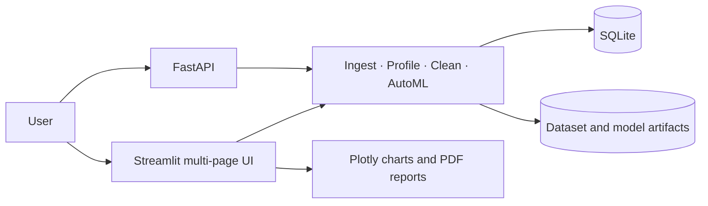

# Insight Engine

**Raw data ko clear insights mein badlo — profile, clean, train, aur predict from one workspace.**

[](https://www.python.org/)
[](https://streamlit.io/)
[](https://fastapi.tiangolo.com/)
[](LICENSE)

## Features

- Import and validate CSV, Excel, JSON, and Parquet datasets.
- Automatic data profiling with type-specific statistics, correlations, quality scoring, and HTML/PDF exports.
- Non-destructive cleaning suggestions and before/after previews.
- Cross-validated AutoML for classification and regression with selectable algorithms.
- Model metrics, feature importance, confusion matrix, ROC curve, residual and prediction diagnostics.
- Interactive prediction forms and a What-If Simulator with baseline deltas and feature sensitivity.
- FastAPI endpoints for datasets, model training, and predictions.
- Shared-secret sign-in for the UI and API-key authentication for protected API routes.
- Configurable upload size limit (25 MiB by default).
- SQLite persistence for datasets, profiles, model runs, and prediction history.
- Responsive dark Streamlit UI and Docker Compose support.

## Architecture



## Setup

Use Python 3.11 or newer. Create and activate a virtual environment, install dependencies, and copy the example environment file:

```bash
python -m venv .venv
# macOS / Linux
source .venv/bin/activate
# Windows PowerShell: .\.venv\Scripts\Activate.ps1
python -m pip install -r requirements.txt
```

Copy `.env.example` to `.env`, then set `INSIGHT_API_KEY` to a newly generated secret (at least 32 characters):

```bash
cp .env.example .env
python -c "import secrets; print(secrets.token_urlsafe(48))"
```

On Windows PowerShell, use `Copy-Item .env.example .env` for the copy step. Paste the generated value into the `INSIGHT_API_KEY` entry in `.env`.

Send the same key to the API as `X-API-Key`. The Streamlit UI prompts for the key on sign-in. This is single-key access control, not per-user identity or multi-tenant authorization; deploy behind HTTPS and do not expose a development instance directly to the public internet. Set `MAX_UPLOAD_SIZE_MB` to adjust the API upload limit.

Run the API and UI in separate terminals:

```bash
python -m uvicorn app.api.server:app --reload
```

```bash
python -m streamlit run app/main.py
```

The public liveness check is at `http://localhost:8000/health`; protected API routes require the `X-API-Key` header. For example:

```bash
curl -H "X-API-Key: $INSIGHT_API_KEY" http://localhost:8000/datasets
```

Interactive API docs are at `/docs`. The UI is at `http://localhost:8501`. Uploads are capped at 25 MiB in the UI and API by default; the API limit can be tuned with `MAX_UPLOAD_SIZE_MB` (the Streamlit server itself also enforces its 25 MiB configured cap).

Or start both services with Docker:

```bash
docker compose up --build
```

Common development commands are available in the `Makefile`: `make install`, `make run-api`, `make run-ui`, `make test`, and `make clean`.

## Public demo on Render

1. Push the repository to GitHub and connect it in Render.
2. In Render, choose **New > Blueprint**, select the branch containing `render.yaml`, review the service, and deploy it.
3. Render prompts for `INSIGHT_API_KEY`. Generate a fresh value with the command above and enter it into Render.
4. Open the deployed `onrender.com` URL and sign in with that same key. The API is available under `/api/` and interactive docs at `/api/docs`.

The Blueprint uses Render's **Free** web-service plan to avoid creating billable compute or storage resources. Free instances can sleep when idle, and their filesystem is ephemeral: uploaded files, SQLite history, and model artifacts can disappear on sleep, restart, or redeploy. Use only disposable demo data; durable hosting requires paid persistent storage or an external database/object store. GitHub Actions checks the Docker image build and Compose configuration.

## Screenshots

Screenshots are not bundled yet; run the UI locally to explore the Profile, Train, and What-If Simulator pages.

## Why this is different

Insight Engine connects dataset quality, profiling, cleaning decisions, model evaluation, and prediction experiments in a single flow. It keeps cleaning suggestions reviewable, evaluates model choices with cross-validation, and lets users explore prediction sensitivity instead of treating a model score as the whole story.

## License and author

Released under the [MIT License](LICENSE).

**Maintainers:** repository contributors
